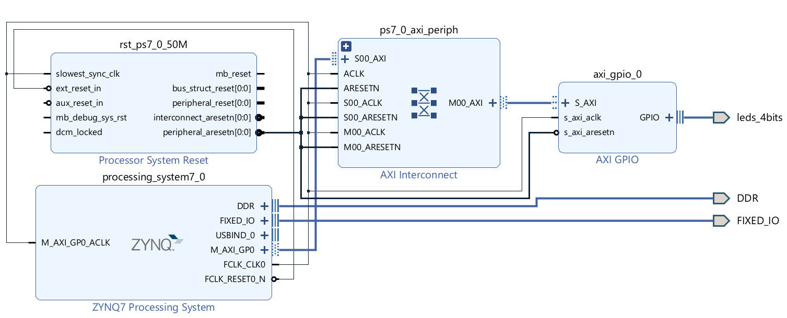
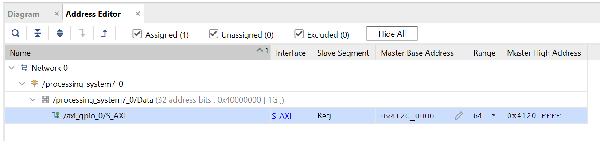

# AXI GPIO

Add an AXI GPIO to the block diagram, as follows:



Use the "Address Editor" tab to grab the base address of the peripheral (you can MMIO talk to this in a pinch):



Regenerate the bitstream and export the hardware platform. Check your IO if necessary.

Writing our PS code using Xilinx API:

```
#include <stdio.h>
#include "xgpio.h"
#include "platform.h"
#include "xil_printf.h"

#define LED_CHANNEL 1

int main()
{
    init_platform();
    XGpio_Config *cfg_ptr;
    XGpio led_device;

    cfg_ptr = XGpio_LookupConfig(XPAR_AXI_GPIO_0_DEVICE_ID);
    XGpio_CfgInitialize(&led_device, cfg_ptr, cfg_ptr->BaseAddress);
    XGpio_SetDataDirection(&led_device, LED_CHANNEL, 0);

    while(1)
    {
    	print("lights on\n\r");
    	XGpio_DiscreteWrite(&led_device, LED_CHANNEL, 0b1111);
    	sleep(2);

    	print("lights off\n\r");
    	XGpio_DiscreteWrite(&led_device, LED_CHANNEL, 0b0000);
    	sleep(1);

    }
    cleanup_platform();
    return 0;
}
```

Now with MMIO (todo: how2play input):

```
int main()
{
    init_platform();
    XGpio_Config *cfg_ptr;
    XGpio led_device;

    uint32_t *BaseAddress = (uint32_t *)0x41200000;

    while(1)
    {
    	print("lights on\n\r");
    	BaseAddress[0] = 0xFFFFFFFF;
    	sleep(2);

    	print("lights off\n\r");
    	BaseAddress[0] = 0x0;
    	sleep(1);

    }
    cleanup_platform();
    return 0;
}
```
