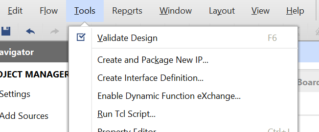
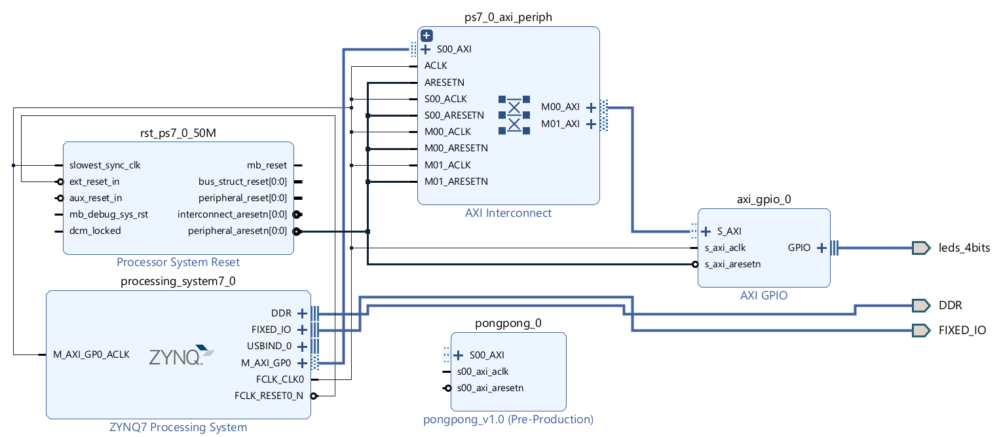
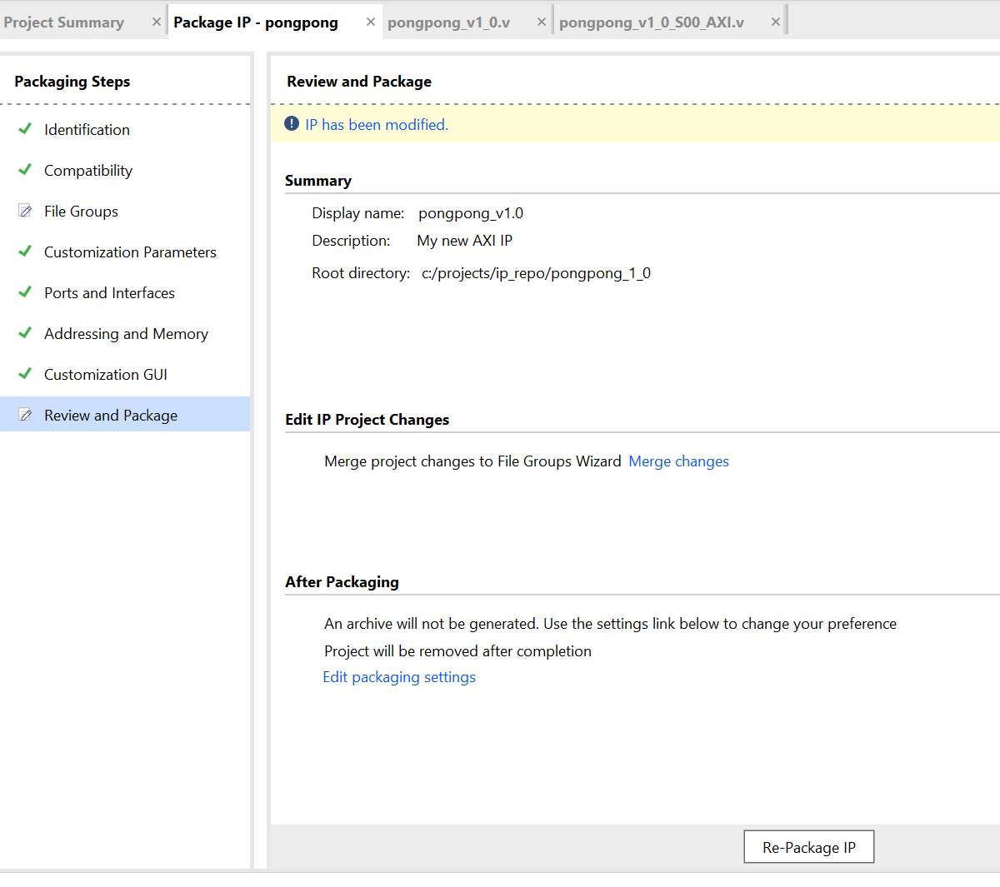
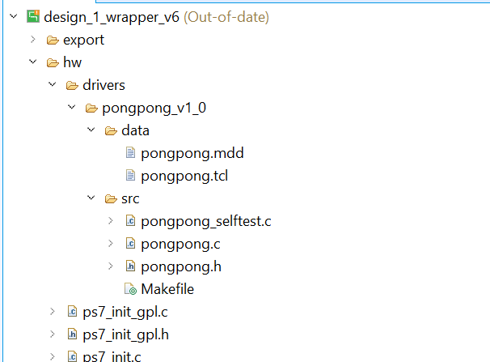

# PS-PL Communications

There is no "universal" way to communicate between PS and PL, but an AXILite peripheral can provide a minimum way to do this from Zynq PS.

AXI Lite uses a register read/write scheme.

First, create an AXI4Lite Slave device:



Select "Create a new AXI4 Peripheral", configure the registers appropriately. Let Vivado package the IP and add it to the project repository. In the block diagram, add your new IP:



Do connection automation (just connecting it to the AXI bus)

Right click the IP in the block diagram, and select "Edit in IP Packager". This opens up a new instance of Vivado. Select the IP's source. Most of the template implements letting the AXI master (PS) talk to a set of registers inside the AXI slave. Search for "user logic" (right at the bottom) and add some sample code:

(Note: this code is... valid but bad, `slv_reg1` doesn't latch automatically, use a dedicated latch register if you want to preserve state).

```
	reg r_out;
	assign w_out = r_out;
	
	always @( posedge S_AXI_ACLK )
	begin
	  if ( slv_reg1 == 32'd12345 ) 
	    begin
	      r_out <= 1;
	    end
	  else if ( slv_reg1 == 32'd54321 )
	    begin
	      r_out <= 0;
	    end
    	end
```

Make sure you enable `w_out` in the top-level definition of the IP, and the... "implementation submodule". Both of these need to define an interface for `w_out` or whatever other Non-AXI interfaces you want. Use Synthesis to do a syntax check if you want.

Select the "Package IP" tab, and select "Review and Package" on the left:



Click "Re-package IP" and then move back to the original project.

Go to the TCL console, and run upgrade\_ip [get\_ips \*]. (Q: Is there a GUI option for this?) 

Leave the new block - run Synthesis and implementation on the new block, open the implemented design and assign a port to `ext_led`


Generate a bitstream and export the hardware platform. Generate a new application project in Vitis. If we build the project now, it will fail. Because Vitis is incredibly helpful at error handling, we'll need to adjust the Makefile of our custom IP to build the platform properly:



For some absolutely insane reason, the ARM-GCC used by Vitis doesn't want to compile \*.c. Change all the Makefiles referencing your custom IP to use the actual source file names instead:

```
COMPILER=
ARCHIVER=
CP=cp
COMPILER_FLAGS=
EXTRA_COMPILER_FLAGS=
LIB=libxil.a

RELEASEDIR=../../../lib
INCLUDEDIR=../../../include
INCLUDES=-I./. -I${INCLUDEDIR}

INCLUDEFILES=*.h
LIBSOURCES=pongpong.c pongpong_selftest.c
OUTS=pongpong.o pongpong_selftest.o

libs:
	echo "Compiling pongpong..."
	echo "asdf"
	echo "$(COMPILER) $(COMPILER_FLAGS) $(EXTRA_COMPILER_FLAGS) $(INCLUDES) $(LIBSOURCES)"
	$(COMPILER) $(COMPILER_FLAGS) $(EXTRA_COMPILER_FLAGS) $(INCLUDES) $(LIBSOURCES)
	$(ARCHIVER) -r ${RELEASEDIR}/${LIB} ${OUTS}
	make clean

include:
	${CP} $(INCLUDEFILES) $(INCLUDEDIR)

clean:
	rm -rf ${OUTS}
```

*Protip: xil_printf.h is missing?*

You'll need to clean this shit out of *all* the makefiles, so navigate to your workspace directory (can't find it, because Vitis likes abstraction? Just open one of the Makefiles in your System Editor and hit Save As). Find the other affected Makefiles with `Get-ChildItem -Recurse * | Select-String -Pattern "pongpong" | Select-Object -Unique Path`, and edit the others.

You need to remove \*.c and \*.o, and replace them with actual filenames. Not sure why?

*Protip: xil_printf.h still missing?*

Sometimes, Vitis will initialize your project with a nonexistent include directory. Check the C/C++ settings for your project. Alternatively, just delete the entire Vitis workspace.

At least it's not as bad as the ST Visual Develop debacle.

Create your C application (Q: does MMIO work here?):

```
#include <stdio.h>
#include "platform.h"
#include "xil_printf.h"
#include "xil_io.h"

#define BASEADDR 0x43c00004

int main()
{
    init_platform();

    while(1)
    {
    	Xil_Out32(BASEADDR,12345);
    	sleep(2);
    	Xil_Out32(BASEADDR,54321);
    	sleep(2);
    }
    print("Hello World\n\r");
    print("Successfully ran Hello World application");
    cleanup_platform();
    return 0;
}
```

# References

- https://support.xilinx.com/s/question/0D52E00006ljfSQSAY/fatal-error-xilprintfh-no-such-file-or-directory-helloworldc?language=en_US
- https://www.hackster.io/j-abate/integrating-zynq-ps-and-pl-with-memory-mapped-registers-292a42
